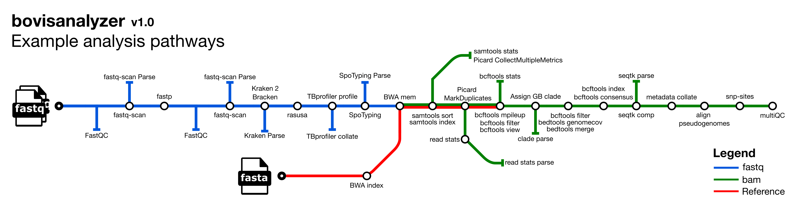

# bovisanalyzer

#  

[](https://www.nextflow.io/)
[](https://docs.conda.io/en/latest/)
[](https://www.docker.com/)
[](https://sylabs.io/docs/)

## Introduction

**bovisanalyzer** is a bioinformatics best-practice analysis pipeline for nextflow pipeline for analyzing *Mycobacterium bovis* genomes. 

The pipeline is built using [Nextflow](https://www.nextflow.io), a workflow tool to run tasks across multiple compute infrastructures in a very portable manner. It uses Docker/Singularity containers making installation trivial and results highly reproducible. The [Nextflow DSL2](https://www.nextflow.io/docs/latest/dsl2.html) implementation of this pipeline uses one container per process which makes it much easier to maintain and update software dependencies. Where possible, these processes have been submitted to and installed from [nf-core/modules](https://github.com/nf-core/modules) in order to make them available to all nf-core pipelines, and to everyone within the Nextflow community!

## Pipeline summary

1. Read QC ([`FastQC`](https://www.bioinformatics.babraham.ac.uk/projects/fastqc/))
2. Calculate fastq summary statistics ([`fastq-scan`](https://github.com/rpetit3/fastq-scan))
3. Index reference fasta file ([`BWA index`](https://github.com/lh3/bwa))
4. Trim reads for quality and adapter sequence ([`fastp`](https://github.com/OpenGene/fastp))
5. Assign taxonomic labels to sequence reads ([`Kraken 2`](https://ccb.jhu.edu/software/kraken2/))
6. Re-estimate taxonomic abundance of samples analyzed by kraken ([`Bracken`](https://ccb.jhu.edu/software/bracken/))
7. Downsample fastq files ([`Rasusa`](https://github.com/mbhall88/rasusa))
8. Detect drug resistance and lineage ([`TB-Profiler`](https://github.com/jodyphelan/TBProfiler))
9. Detect spoligotype ([`SpoTyping`](https://github.com/xiaeryu/SpoTyping-v2.0))
10. Assign GB WGS clade ([`APHA-CSU`](https://github.com/APHA-CSU/btb-seq))
11. Variant calling
    1. Read mapping ([`BWA mem`](https://github.com/lh3/bwa))
    2. Sort and index alignments ([`SAMtools`](https://sourceforge.net/projects/samtools/files/samtools/))
    3. Duplicate read marking ([`picard`](https://broadinstitute.github.io/picard/))
    4. Call and filter variants ([`BCFtools`](http://samtools.github.io/bcftools/bcftools.html))
    5. Convert filtered vcf to pseudogenome fasta ([`BCFtools`](http://samtools.github.io/bcftools/bcftools.html))
    6. Mask each pseudogenome with zero-coverage, low coverage and poorly mapped regions ([`BCFtools`](http://samtools.github.io/bcftools/bcftools.html))
    7. Calculate the percentage of the reference mapped in each pseudogenome fasta ([`seqtk`](https://github.com/lh3/seqtk))
12. Create alignment from pseudogenome by concatenating fasta files having first checked that the sample sequences are high quality([`calculate_fraction_of_non_GATC_bases.py`](https://github.com/nf-core/bactmap/blob/dev/bin/))
13. Extract variant sites from alignment ([`SNP-sites`](https://github.com/sanger-pathogens/snp-sites))
14. Summarise fastq metrics, species composition, genotyping and mapping statistics
15. Present QC and visualisation for raw read, alignment, assembly and variant calling results ([`MultiQC`](http://multiqc.info/))

## Quick Start

1. Install [`Nextflow`](https://www.nextflow.io/docs/latest/getstarted.html#installation) (`>=21.10.3`)

2. Install any of [`Docker`](https://docs.docker.com/engine/installation/), [`Singularity`](https://www.sylabs.io/guides/3.0/user-guide/) (you can follow [this tutorial](https://singularity-tutorial.github.io/01-installation/)), [`Podman`](https://podman.io/), [`Shifter`](https://nersc.gitlab.io/development/shifter/how-to-use/) or [`Charliecloud`](https://hpc.github.io/charliecloud/) for full pipeline reproducibility _(you can use [`Conda`](https://conda.io/miniconda.html) both to install Nextflow itself and also to manage software within pipelines. Please only use it within pipelines as a last resort; see [docs](https://nf-co.re/usage/configuration#basic-configuration-profiles))_.

3. Download taxonomic databases for Kraken 2 and Bracken (this is a large file and may take a while):

   ```console
   wget ftp://ftp.ccb.jhu.edu/pub/data/kraken2_dbs/old/minikraken2_v1_8GB_201904.tgz

   tar xvfz minikraken2_v1_8GB_201904.tgz
   ```

4. An executable Python script called [`fastq_dir_to_samplesheet.py`](https://github.com/avantonder/bovisanalyzer/blob/main/bin/fastq_dir_to_samplesheet.py) has been provided and would like to auto-create an input samplesheet based on a directory containing FastQ files **before** you run the pipeline (requires Python 3 installed locally) e.g.

     ```console
     wget -L https://raw.githubusercontent.com/avantonder/bovisanalyzer/main/bin/fastq_dir_to_samplesheet.py
     ./fastq_dir_to_samplesheet.py <FASTQ_DIR> samplesheet.csv -r1 <FWD_FASTQ_SUFFIX> -r2 <REV_FASTQ_SUFFIX>

Alternatively the samplesheet.csv file created by nf-core/fetchngs can also be used.

5. Start running your own analysis!

   - Typical command

   ```bash
    nextflow run avantonder/bovisanalyzer \
        -profile <docker/singularity/podman/conda/institute> \
        --input samplesheet.csv \
        --reference <REFERENCE FASTA> \
        --kraken2db minikraken2_v1_8GB \
        --brackendb minikraken2_v1_8GB \
        --outdir <OUTDIR>
    ```

   Note that some form of configuration will be needed so that Nextflow knows how to fetch the required software. This is usually done in the form of a config profile (`YOURPROFILE` in the example command above). You can chain multiple config profiles in a comma-separated string.

   > - The pipeline comes with config profiles called `docker`, `singularity`, `podman`, `shifter`, `charliecloud` and `conda` which instruct the pipeline to use the named tool for software management. For example, `-profile test,docker`.
   > - Please check [nf-core/configs](https://github.com/nf-core/configs#documentation) to see if a custom config file to run nf-core pipelines already exists for your Institute. If so, you can simply use `-profile <institute>` in your command. This will enable either `docker` or `singularity` and set the appropriate execution settings for your local compute environment.
   > - If you are using `singularity`, please use the [`nf-core download`](https://nf-co.re/tools/#downloading-pipelines-for-offline-use) command to download images first, before running the pipeline. Setting the [`NXF_SINGULARITY_CACHEDIR` or `singularity.cacheDir`](https://www.nextflow.io/docs/latest/singularity.html?#singularity-docker-hub) Nextflow options enables you to store and re-use the images from a central location for future pipeline runs.
   > - If you are using `conda`, it is highly recommended to use the [`NXF_CONDA_CACHEDIR` or `conda.cacheDir`](https://www.nextflow.io/docs/latest/conda.html) settings to store the environments in a central location for future pipeline runs.

## Documentation

The avantonder/bovisanalyzer pipeline comes with documentation about the pipeline [usage](https://nf-co.re/bovisanalyzer/usage), [parameters](https://nf-co.re/bovisanalyzer/parameters) and [output](https://nf-co.re/bovisanalyzer/output).

## Acknowledgements

avantonder/bovisanalyzer was originally written by Andries van Tonder.

I wouldn't have been able to write this pipeline with out the tools, documentation, pipelines and modules made available by the fantastic [nf-core community](https://nf-co.re/).  In particular bovisanalyzer owes much to the excellent [bactmap](https://nf-co.re/bactmap) pipeline.

## Feedback

If you have any issues, questions or suggestions for improving bovisanalyzer, please submit them to the [Issue Tracker](https://github.com/avantonder/bovisanalyzer/issues).

## Citations

An extensive list of references for the tools used by the pipeline can be found in the [`CITATIONS.md`](CITATIONS.md) file.

You can cite the `nf-core` publication as follows:

> **The nf-core framework for community-curated bioinformatics pipelines.**
>
> Philip Ewels, Alexander Peltzer, Sven Fillinger, Harshil Patel, Johannes Alneberg, Andreas Wilm, Maxime Ulysse Garcia, Paolo Di Tommaso & Sven Nahnsen.
>
> _Nat Biotechnol._ 2020 Feb 13. doi: [10.1038/s41587-020-0439-x](https://dx.doi.org/10.1038/s41587-020-0439-x).
