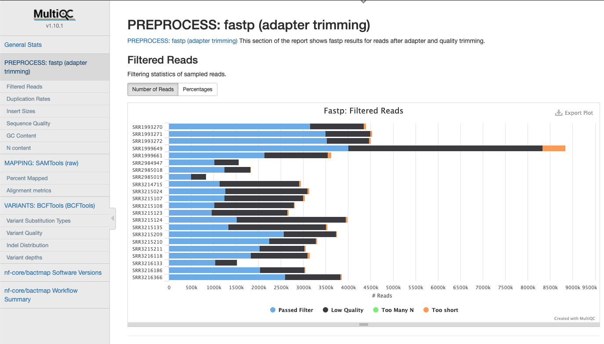
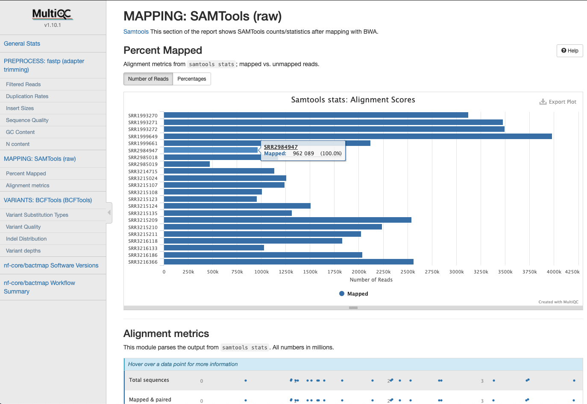
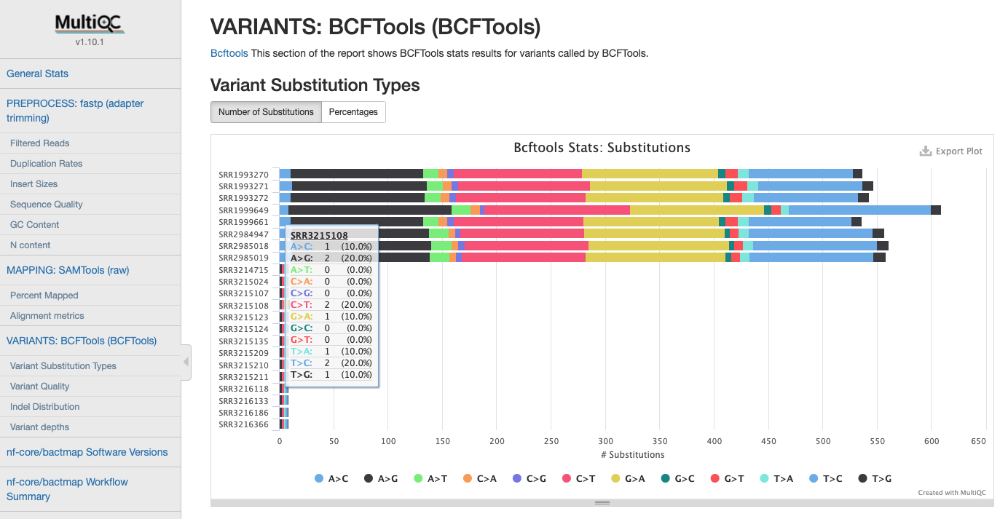
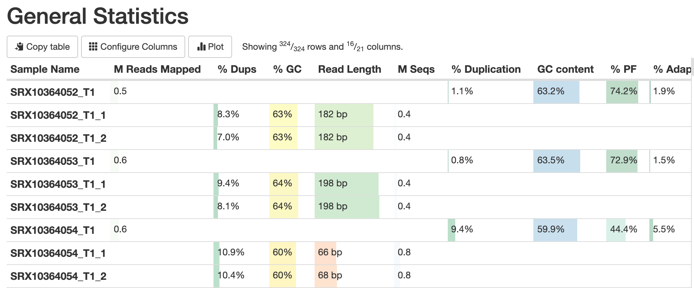

# avantonder/bovisanalyzer: Output

## Introduction

This document describes the output produced by the pipeline. Most of the plots are taken from the MultiQC report, which summarises results at the end of the pipeline.

The directories listed below will be created in the results directory after the pipeline has finished. All paths are relative to the top-level results directory.

## Pipeline overview

The pipeline is built using [Nextflow](https://www.nextflow.io/) and processes data using the following steps:

- [`FastQC`](#fastqc)
- [`Fastq summary statistics`](#fastq-summary-statistics)
- [`Reference indexing`](#reference-indexing)
- [`Read trimming`](#read-trimming)
- [`Assign taxonomy to reads`](#assign-taxonomy-to-reads)
- [`Re-estimate taxonomy`](#re-estimate-taxonomy)
- [`Read subsampling`](#read-subsampling)
- [`Detect drug resistance and lineage`](#detect-drug-resistance-and-lineage)
- [`Detect spoligotype`](#detect-spoligotype)
- [`Read mapping`](#read-mapping)
- [`Sort bam files`](#sort-bam-files)
- [`Call and filter variants`](#call-and-filter-variants)
- [`Convert filtered vcf to pseudogenome`](#convert-filtered-vcf-to-pseudogenome)
- [`Create alignment from pseudogenomes`](#create-alignment-from-pseudogenomes)
- [`Mask alignment`](#mask-alignment)
- [`Remove non-informative positions`](#remove-non-informative-positions)
- [`Summarise sample metadata`](#summarise-sample-metadata)
- [`MultiQC`](#multiqc) 
- [`Pipeline information`](#pipeline-information)

### FastQC

Output files

- `fastqc/`
  - `*_fastqc.html`: FastQC report containing quality metrics.
  - `*_fastqc.zip`: Zip archive containing the FastQC report, tab-delimited data file and plot images.

[FastQC](http://www.bioinformatics.babraham.ac.uk/projects/fastqc/) gives general quality metrics about your sequenced reads. It provides information about the quality score distribution across your reads, per base sequence content (%A/T/G/C), adapter contamination and overrepresented sequences. For further reading and documentation see the [FastQC help pages](http://www.bioinformatics.babraham.ac.uk/projects/fastqc/Help/).

> **NB:** The FastQC plots displayed in the MultiQC report shows _untrimmed_ reads. They may contain adapter sequence and potentially regions with low quality.

### Fastq summary statistics

Output files

- `fastqscan/`
  - `*.json`: JSON formatted file of summary statistics.

[fastq-scan](https://github.com/rpetit3/fastq-scan) is a tool for generating FASTQ summary statistics in JSON format.

### Reference Indexing

In order to map the reads to the reference sequence it is indexed.

Output files

* `bwa/index.`
    * `*.amb`
    * `*.ann`
    * `*.bwt`
    * `*.pac`
    * `*.sa`

> These files are generally not required except for in the mapping step

### Read Trimming

Output files

* `fastp/`
    * `*.html` html reports of the trimming process that can be opened in any modern web browser. See [here](http://opengene.org/fastp/fastp.html) for an example
    * `*.json` trimming report metrics in JSON computer readable formats. See [here](http://opengene.org/fastp/fastp.json) for an example

[fastp](https://github.com/OpenGene/fastp) is a tool used to perform adapter/quality trimming on sequencing reads.

### Assign taxonomy to reads

Output files

* `kraken2/`
    * `*.kraken2.report.txt`: Kraken 2 taxonomic report. See [here](https://ccb.jhu.edu/software/kraken2/index.shtml?t=manual#sample-report-output-format) for a detailed description of the format.

[Kraken 2](https://ccb.jhu.edu/software/kraken2/index.shtml?t=manual) is a sequence classifier that assigns taxonomic labels to DNA sequences. Kraken 2 examines the k-mers within a query sequence and uses the information within those k-mers to query a database. That database maps k-mers to the lowest common ancestor (LCA) of all genomes known to contain a given k-mer.

### Re-estimate taxonomy

Output files

* `bracken/`
    * `*_S.tsv`: Bracken TSV output report of the re-estimated abundances. See [here](https://ccb.jhu.edu/software/bracken/index.shtml?t=manual) for a detailed description of the format.

[Bracken](https://ccb.jhu.edu/software/bracken/) (Bayesian Reestimation of Abundance with KrakEN) is a highly accurate statistical method that computes the abundance of species in DNA sequences from a metagenomics sample.

### Read Subsampling

Output files

* `rasusa/`
    * `*.fastq.gz` subsampled fastq files

[rasusa](https://github.com/mbhall88/rasusa) is used to subsample reads to a depth cutoff of a default of 100.

### Detect drug resistance and lineage

Output files

* `tbprofiler/results/`
    * `*.csv` CSV formated result file of resistance and strain type
    * `*.txt` JSON formated result file of resistance and strain type
    * `*.json` Text file of resistance and strain type
* `tbprofiler/`
    * `tbprofiler.variants.txt` Text file of variants for all samples
    * `tbprofiler.txt` Text file of lineage and variants for all samples
    * `tbprofiler.lineage.itol.txt` Text file in iTOL format of lineage for all samples
    * `tbprofiler.json` Json file of lineage and variants for all samples
    * `tbprofiler.dr.itol.txt` Text file in iTOL format of drug resistance profile for all samples
    * `tbprofiler.dr.indiv.itol.txt` Text file in iTOL format of individual drug resistance profiles for all samples

[TB-profiler](https://github.com/jodyphelan/TBProfiler) is a profiling tool for *Mycobacterium tuberculosis* to detect drug resistance and lineage from WGS data

### Detect spoligotype

Output files

* `spoligotype/`
    * `*.txt` Text file containing binary, octal and SB number
    * `Spoligotype_summary.tsv` Summary of spoligotypes for all samples

[vsnp_spoligotype.py](https://github.com/USDA-VS/vSNP) is a tool from the vSNP pipeline for extracting the spoligotype binary from the sequence reads and looking them up in the spoligotype_db.txt file in the assets directory.

### Read Mapping

By default the the bam files created are not saved since sorted bam files are produced in the next step.

### Sort Bam Files

After mapping the bam files are sorted and statistics calculated.

Output files

* `samtools/`
    * `*.bam` sorted bam files
    * `*.bam.bai` bam file index
    * `*.bam.flagstat` bam file metrics
    * `*.bam.idxstats` bam file metrics
    * `*.bam.stats` bam file metrics

### Call and Filter Variants

The `bcftools` software is used to call and filter variants found within the bam files.

Output files

* `variants/`
    * `*.vcf.gz` filtered vcf files containing variants

### Convert Filtered VCF to Pseudogenome

The filtered vcf files are converted to a pseudogenome.

Output files

* `pseudogenomes/`
    * `*.fas` pseudogenome with a base at each position of the reference sequence

### Create Alignment from Pseudogenomes

Only those pseudogenome fasta files that have a non-ACGT fraction less than the threshold specified will be included in the `aligned_pseudogenomes.fas` file. Those failing this will be reported in the `low_quality_pseudogenomes.tsv` file.

Output files

* `pseudogenomes/`
    * `masked_alignment.fas` alignment of all sample pseudogenomes and the reference sequence
    * `low_quality_pseudogenomes.tsv` a tab separated file of the samples that failed the non-ACGT base threshold

### Mask alignment

Output files

* `pseudogenomes/`
    * `masked_alignment.fas` masked alignment of all sample pseudogenomes and the reference sequence

[`remove_blocks_from_aln`](https://github.com/sanger-pathogens/remove_blocks_from_aln) is a tool for masking sites in an alignment using coordinates contained in the AF2122_region_exclude file in the assets directory.

### Remove Non-informative Positions

Before building trees, non-informative constant sites are removed from the alignment using `snp-sites`

Output files

* `snpsites/`
    * `constant.sites.txt` A file with the number of constant sites for each base
    * `filtered_alignment.fas` Alignment with only informative positions (those positions that have at least one alternative variant base)

### MultiQC

Output files

- `multiqc/`
  - `multiqc_report.html`: a standalone HTML file that can be viewed in your web browser.
  - `multiqc_data/`: directory containing parsed statistics from the different tools used in the pipeline.
  - `multiqc_plots/`: directory containing static images from the report in various formats.

[MultiQC](http://multiqc.info) is a visualization tool that generates a single HTML report summarising all samples in your project. Most of the pipeline QC results are visualised in the report and further statistics are available in the report data directory.

Results generated by MultiQC collate pipeline QC from supported tools e.g. FastQC. The pipeline has special steps which also allow the software versions to be reported in the MultiQC output for future traceability. For more information about how to use MultiQC reports, see <http://multiqc.info>.

### Pipeline information

Output files

- `pipeline_info/`
  - Reports generated by Nextflow: `execution_report.html`, `execution_timeline.html`, `execution_trace.txt` and `pipeline_dag.dot`/`pipeline_dag.svg`.
  - Reports generated by the pipeline: `pipeline_report.html`, `pipeline_report.txt` and `software_versions.yml`. The `pipeline_report*` files will only be present if the `--email` / `--email_on_fail` parameter's are used when running the pipeline.
  - Reformatted samplesheet files used as input to the pipeline: `samplesheet.valid.csv`.

[Nextflow](https://www.nextflow.io/docs/latest/tracing.html) provides excellent functionality for generating various reports relevant to the running and execution of the pipeline. This will allow you to troubleshoot errors with the running of the pipeline, and also provide you with other information such as launch commands, run times and resource usage.
